# BiliDown

BiliDown 是一款跨平台 B 站视频解析与下载管理工具，面向需要把自己有权保存的内容归档到本机的用户。它支持链接解析、分集选择、批量下载、历史/收藏/UP 主内容检索、附加资源导出、任务恢复、格式转换和本地文件管理。

> BiliDown 是非官方第三方工具，与哔哩哔哩及其关联主体不存在隶属、授权、合作或赞助关系。使用前请确认你对目标内容拥有合法处理权限，并遵守平台条款和所在地法律。

## 支持平台

当前发布包只提供以下环境：

| 平台 | 发布形式 | 说明 |
| --- | --- | --- |
| Android | APK | 手机和平板可安装使用。 |
| Windows x64 | 压缩包或安装包 | 仅支持 x64，不提供 Windows ARM64 包。 |
| Linux x64 | 压缩包或安装包 | 面向常见 x64 桌面发行版。 |
| macOS arm64 | 应用包 | 适用于 Apple Silicon Mac。 |
| macOS x86_64 | 应用包 | 适用于 Intel Mac。 |
| iOS | unsigned app | 未签名包，需要用户自行按设备环境安装。 |

## 功能概览

- 视频解析：支持 BV、AV、EP、SS、b23.tv 短链接、普通多 P、PGC 分集和 UGC 合集。
- 解析历史：本地保存最近解析快照，可快速恢复到解析页，也可清空或删除单条记录。
- 分集选择：多 P、合集和番剧分集支持单选、全选和批量加入任务。
- 任务队列：待下载、下载中、已下载三类状态分离，支持暂停、继续、重试、清空、删除记录和任务恢复。
- 下载内容：可选择封面、音频、XML 弹幕、ASS 弹幕、字幕等附加资源。
- 批量操作：支持批量解析下载，也支持批量导出封面、音频、弹幕、字幕等附加资源。
- 质量偏好：支持默认音质、默认画质、视频编码、重名策略、并发数量和文件命名模板。
- 登录能力：支持 B 站 App 授权和扫码登录，登录后可读取账号有权访问的高清资源、历史、收藏和点赞。
- 个人中心：支持历史记录、投稿、收藏夹、最近点赞、收藏搜索和历史搜索。
- UP 主页：支持查看 UP 投稿、公开收藏、公开合集，并可在 UP 视频中搜索和批量下载。
- 本地管理：已下载文件可查看详情、打开系统文件管理器目录、复制信息、删除记录和进行格式转换。
- 桌面能力：支持桌面侧栏、系统托盘、通知、提示音、自动关机、缓存清理和脱敏日志导出。
- 移动体验：手机端使用底部导航和子页面结构，保留核心下载、搜索、设置和账号能力。
- 法律与许可：内置隐私声明、版权使用说明、开源许可证和第三方原生组件许可入口。

## 使用手册

### 1. 解析视频

打开「解析」页，粘贴 B 站视频、番剧、合集或短链接，点击「解析视频」。解析完成后会展示封面、标题、UP 主、发布时间、时长、简介和可选分集。

开启「剪贴板监听」后，复制 B 站链接时应用会提示是否解析。应用不会静默下载，也不会上传剪贴板内容。

### 2. 选择清晰度和下载内容

解析结果中可以选择需要下载的分集。默认音质、画质、编码和附加内容来自「设置」页，加入任务前也可以按当前资源能力进行调整。

可选附加内容包括：

- 封面
- 音频
- XML 弹幕
- ASS 弹幕
- 字幕

未登录或账号无权限时，可用清晰度和音质以 B 站接口实际返回为准。

### 3. 管理下载任务

「任务」页分为：

- 待下载：已加入队列但尚未启动的任务。
- 下载中：正在解析、下载、等待合并或合并中的任务。
- 已下载：完成后的任务记录和本地文件。

下载中任务支持暂停、继续和批量控制；下载全部完成后可以设置一次性自动关机。失败任务可选择排队重试或立即重试，应用会尽量刷新过期媒体地址后再继续。

### 4. 查看已下载文件

已下载任务可以进入详情页查看视频信息、本地文件和附加资源。点击文件标题或打开目录按钮会使用系统文件管理器打开所在目录，方便继续播放、移动、复制或删除。

视频、音频和部分资源支持本地格式转换。转换过程中相关删除操作会被禁用，避免文件处理和任务记录不一致。

### 5. 登录 B 站账号

进入「个人」页或点击登录入口后，可使用 B 站 App 授权或扫码登录。Cookie 与刷新令牌仅保存在系统安全存储中，退出登录会清除本机保存的登录凭据。

登录后可使用：

- 当前账号历史记录
- 当前账号收藏夹
- 当前账号最近点赞
- 历史搜索
- 收藏搜索
- 更高清晰度和账号权限相关资源

### 6. 搜索与批量下载

个人中心和 UP 主页中的搜索页只展示可解析的视频内容。可以按关键词筛选结果，进入选择模式后勾选多条视频，再批量解析下载。

历史搜索支持按关键词、时间、时长和设备来源筛选；收藏搜索支持在当前账号全部收藏视频中按关键词检索。

### 7. 查看 UP 内容

解析页、个人内容和视频详情中的 UP 入口可以进入 UP 主页。UP 页面支持：

- 投稿列表
- 公开收藏夹
- 公开合集
- UP 视频搜索
- 收藏夹或合集详情
- 批量解析下载

公开内容受 UP 主隐私设置和 B 站接口限制影响，读取不到时会显示空态或错误提示。

### 8. 设置偏好

「设置」页可以调整：

- 系统提示音和按钮提示音
- 下载保存目录
- 剪贴板监听
- 默认下载内容
- 默认音质：64K、132K、192K、杜比全景声、Hi-Res 无损
- 默认画质：360P、480P、720P、1080P、1080 高码、1080 高帧、4K、HDR、杜比、8K
- 视频编码偏好：AVC、AV1、HEVC
- 文件命名模板
- 重名处理策略
- 同时下载任务数量
- 缓存清理
- 脱敏日志导出
- 开源许可证、第三方许可、隐私声明和版权使用说明

## 界面预览

### 桌面端


### 手机端

<p>
  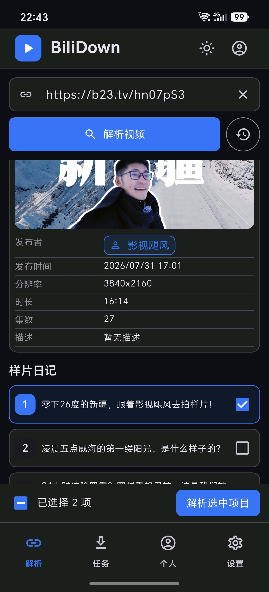
  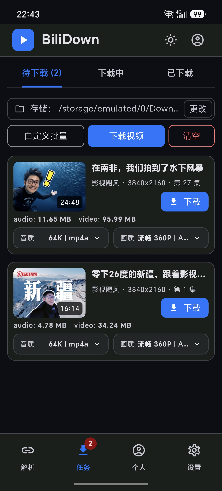
  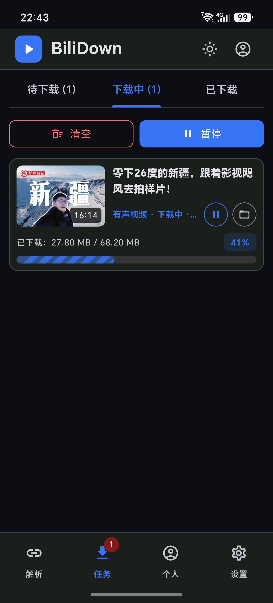
  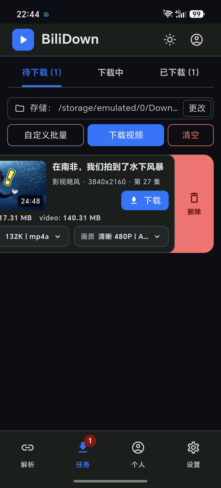
  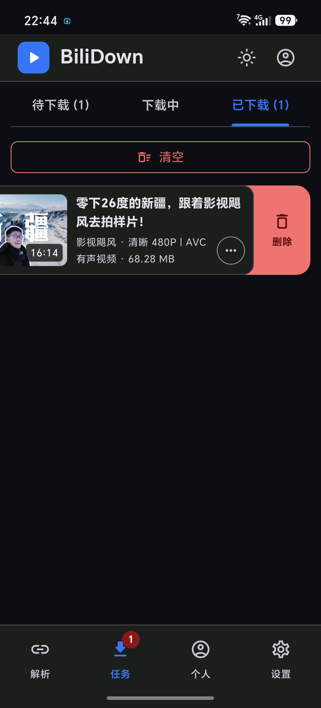
  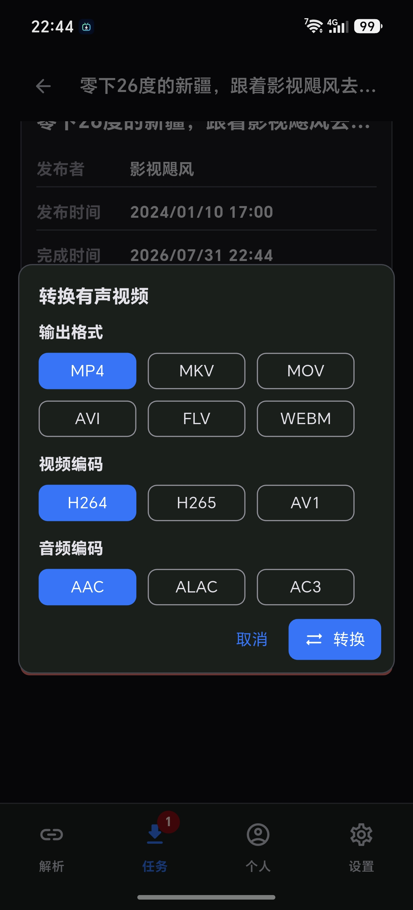
  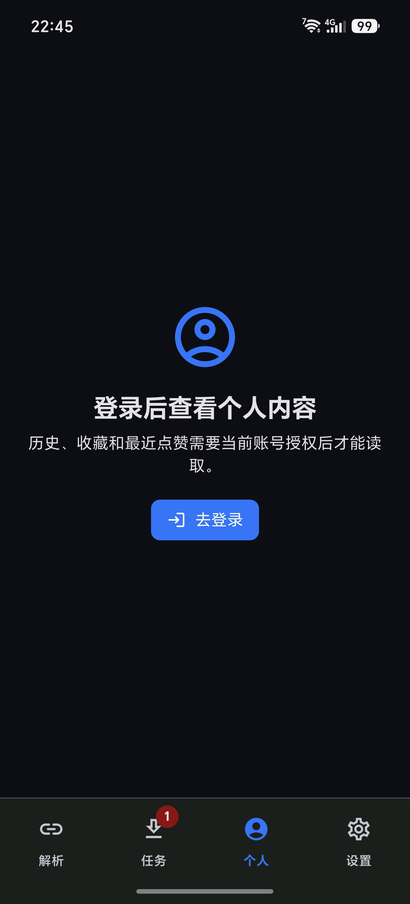
  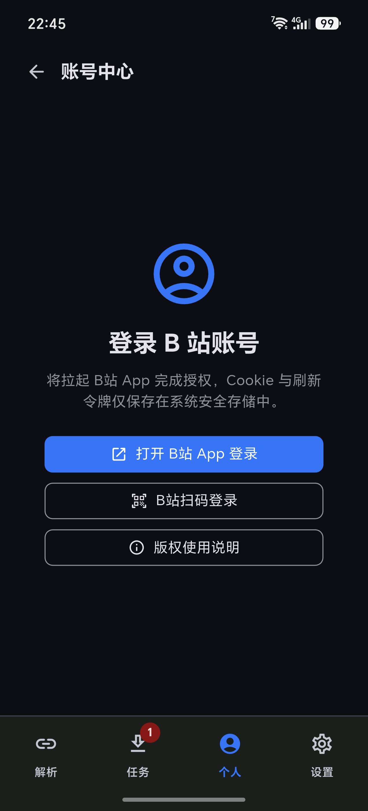
  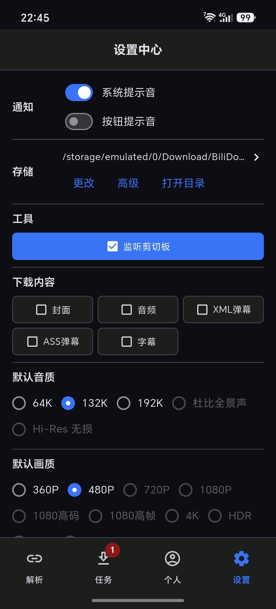
  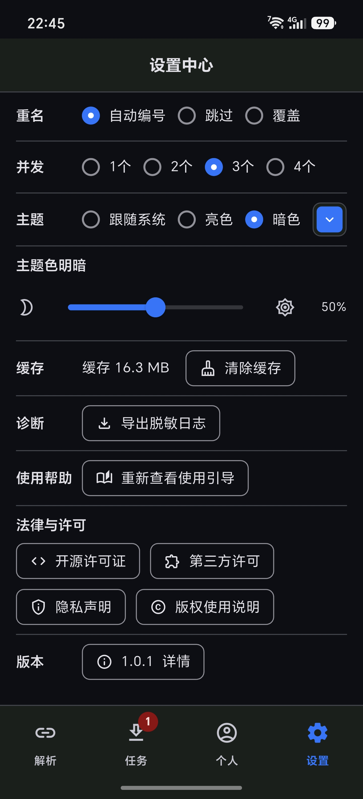
  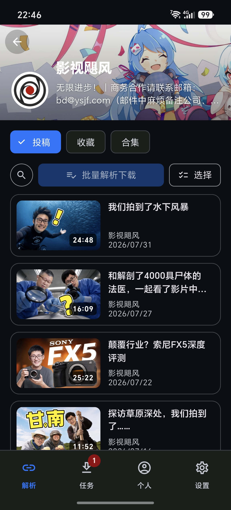
  
  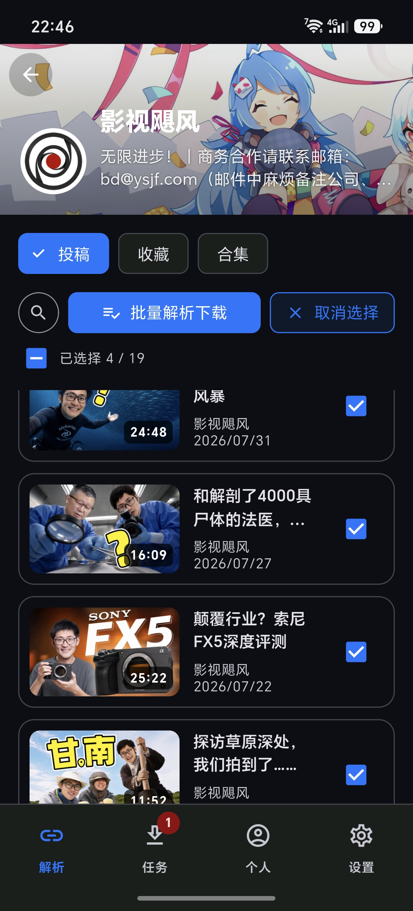
  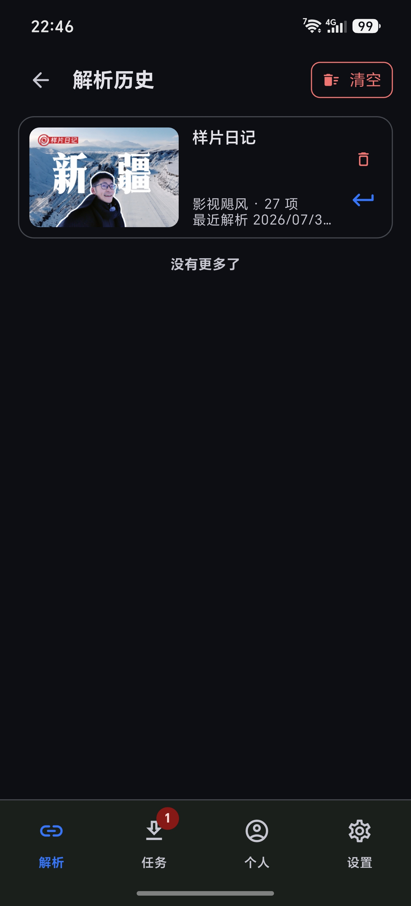
</p>

## 下载与安全

请只从项目发布页、README 或发布说明中列出的 HTTPS 地址获取安装包。若发布包附带 `SHA256SUMS.txt`，建议下载后校验文件哈希，确认文件未被篡改。

Windows 用户可以在 PowerShell 中校验：

```powershell
Get-FileHash .\BiliDown-windows-x64.zip -Algorithm SHA256
```

如果安全软件提示风险，请先确认下载来源和 SHA-256。更多说明见 [下载校验与安全软件误报说明](docs/security-and-verification.md)。

## 合规与隐私

- 本工具只提供本地解析、下载管理和本地文件处理能力。
- 本工具不提供 DRM 破解、会员权限提升、地区限制绕过、资源上传或云端存储服务。
- 下载和后续使用内容前，请确认你拥有权利、已获得授权，或法律法规允许保存。
- 账号 Cookie、刷新令牌等敏感信息仅保存在系统安全存储中。
- 任务记录、设置、缓存和日志保存在本机；诊断日志只有在你主动导出时才会写入文件。
- 详细说明见 [版权与使用说明](docs/copyright-and-usage.md) 和 [隐私声明](docs/privacy.md)。

## 开源许可证与第三方组件

应用内「设置 → 法律与许可」可查看 Flutter/Dart 依赖许可证、第三方原生组件许可、隐私声明和版权使用说明。

发布包中使用的关键运行时组件包括 Flutter / Dart、aria2、FFmpegKit、FFmpeg CLI、SQLite / sqlite3、Dio、Drift、Riverpod、go_router 等。原生二进制的许可证、源码地址、构建信息和哈希说明见：

- [第三方许可证说明](docs/third-party-licenses.md)
- [随包运行组件说明](docs/runtime-components.md)
- [原生工具来源说明](docs/native-components.md)
- [BiliDown 工作原理简述](docs/how-it-works.md)
- [应用身份说明](docs/app-identity.md)
